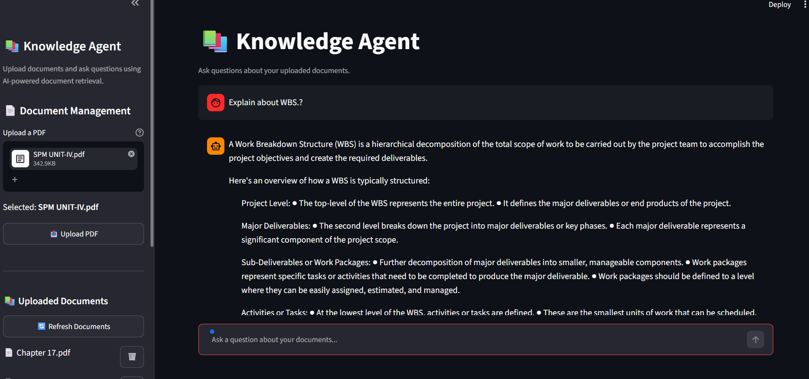

# 🤖 Knowledge Agent — AI-Powered PDF Question Answering

An AI-powered Retrieval-Augmented Generation (RAG) application that allows users to upload PDF documents and ask natural-language questions about their content.

The application retrieves relevant information from uploaded documents and uses a local Llama 3.2 model to generate grounded answers with source references.

---

## ✨ Features

- 📄 PDF document upload
- 🔍 Semantic document search
- 🧩 Intelligent document chunking
- 🧠 Hugging Face embeddings
- 🗄️ ChromaDB vector database
- 🤖 Llama 3.2 through Ollama
- 💬 Conversational question answering
- 📚 Source and page references
- 🔁 Conversation history
- 🚫 Duplicate document detection
- 📋 Document registry and management
- ⚡ FastAPI backend
- 🎨 Streamlit frontend

---


# 🤖 Knowledge Agent — AI-Powered PDF Question Answering

An AI-powered Retrieval-Augmented Generation (RAG) application that allows users to upload PDF documents and ask natural-language questions about their content.

---

## 📸 Application Preview



The application provides a simple interface for uploading PDF documents, asking questions, and viewing answers with source references.

---


## 🏗️ Architecture

```text
                    ┌─────────────────────┐
                    │       User          │
                    └──────────┬──────────┘
                               │
                               ▼
                    ┌─────────────────────┐
                    │ Streamlit Frontend  │
                    │      UI / Chat       │
                    └──────────┬──────────┘
                               │
                               ▼
                    ┌─────────────────────┐
                    │    FastAPI Backend  │
                    │      REST API       │
                    └──────────┬──────────┘
                               │
                    ┌──────────┴──────────┐
                    │                     │
                    ▼                     ▼
          ┌─────────────────┐   ┌─────────────────┐
          │ PDF Ingestion   │   │ Query Processing│
          └────────┬────────┘   └────────┬────────┘
                   │                     │
                   ▼                     ▼
          ┌─────────────────┐   ┌─────────────────┐
          │ Text Extraction │   │ Semantic Search │
          │ & Chunking      │   └────────┬────────┘
          └────────┬────────┘            │
                   │                     │
                   ▼                     ▼
          ┌─────────────────────────────────────┐
          │             ChromaDB                │
          │        Vector Store / Retrieval     │
          └──────────────────┬──────────────────┘
                             │
                             ▼
                   ┌─────────────────────┐
                   │     Llama 3.2       │
                   │      Ollama         │
                   └──────────┬──────────┘
                              │
                              ▼
                   ┌─────────────────────┐
                   │ Answer + Sources    │
                   └─────────────────────┘