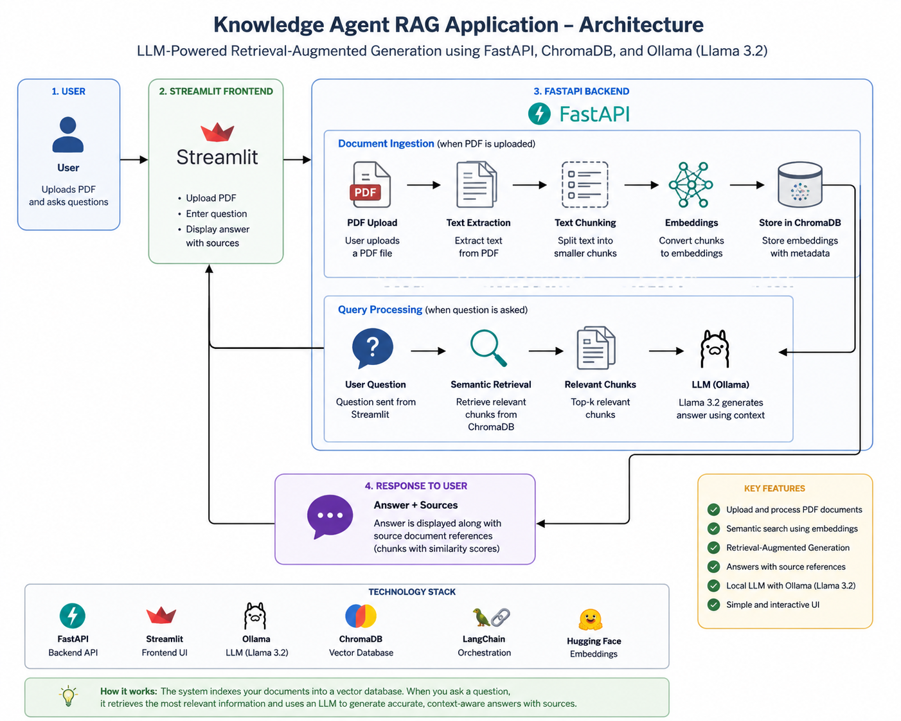

# 🤖 Knowledge Agent — AI-Powered PDF Question Answering

An AI-powered Retrieval-Augmented Generation (RAG) application that allows users to upload PDF documents and ask natural-language questions about their content.

The system extracts and chunks document content, generates semantic embeddings, retrieves relevant information from ChromaDB, and uses a local Llama 3.2 model through Ollama to generate grounded answers with source references.

---

## 📸 Application Preview


The application provides an interactive interface for uploading PDF documents, asking questions, and viewing answers with source references.

---

## 🏗️ Architecture



```text
                         ┌─────────────────────┐
                         │        User         │
                         └──────────┬──────────┘
                                    │
                                    ▼
                         ┌─────────────────────┐
                         │ Streamlit Frontend  │
                         │      UI / Chat      │
                         └──────────┬──────────┘
                                    │
                                    ▼
                         ┌─────────────────────┐
                         │   FastAPI Backend   │
                         │      REST API       │
                         └──────────┬──────────┘
                                    │
                    ┌───────────────┴───────────────┐
                    │                               │
                    ▼                               ▼
           ┌─────────────────┐             ┌─────────────────┐
           │ PDF Ingestion   │             │ Query Processing│
           └────────┬────────┘             └────────┬────────┘
                    │                               │
                    ▼                               ▼
           ┌─────────────────┐             ┌─────────────────┐
           │ Text Extraction │             │ Semantic Search │
           │ & Chunking       │             └────────┬────────┘
           └────────┬────────┘                      │
                    │                               │
                    └───────────────┬───────────────┘
                                    ▼
                         ┌─────────────────────┐
                         │      ChromaDB       │
                         │ Vector Store / RAG  │
                         └──────────┬──────────┘
                                    │
                                    ▼
                         ┌─────────────────────┐
                         │      Llama 3.2      │
                         │       Ollama        │
                         └──────────┬──────────┘
                                    │
                                    ▼
                         ┌─────────────────────┐
                         │   Answer + Sources  │
                         └─────────────────────┘